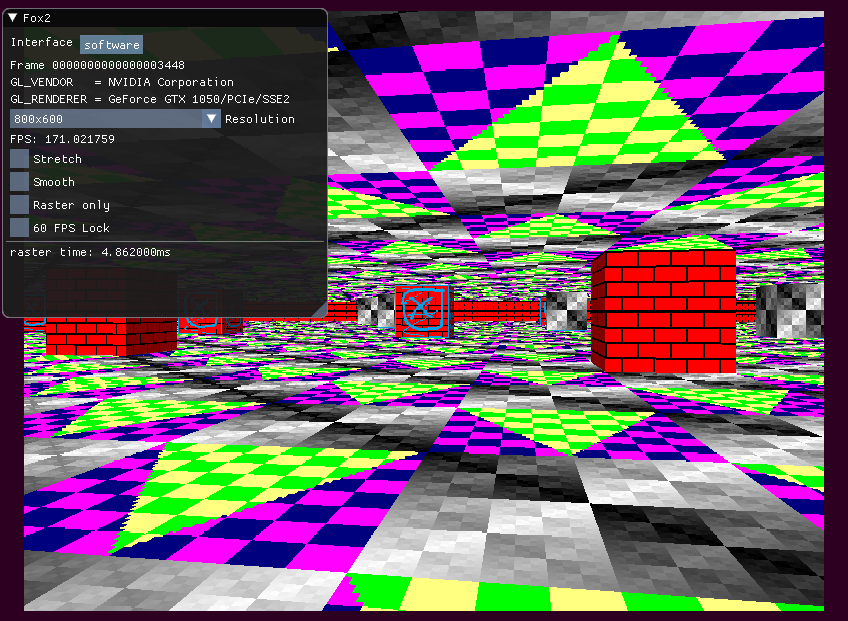
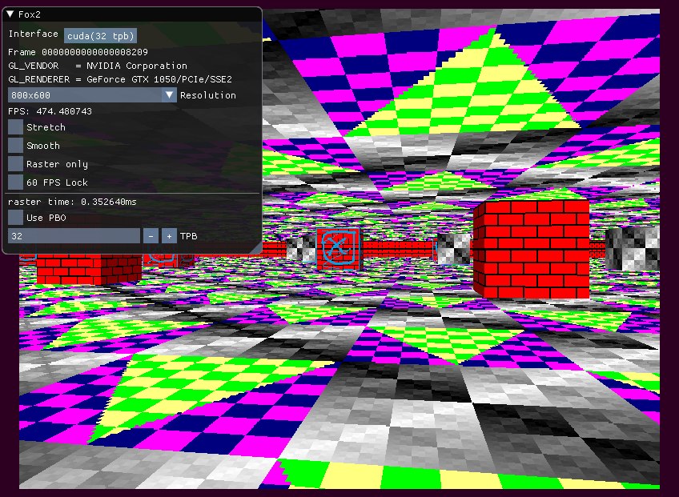

Like FoxRaycaster([link](https://github.com/FRex/FoxRaycaster)) but with
a nicer GUI, bug fixes, more optimized and with CUDA.

Used in project:
* Code from FoxRaycaster, which was based on this tutorial: [link](https://lodev.org/cgtutor/raycasting.html)
* OpenGL 2.1 (header and source gl_core21 generated using glLoadGen: [link](https://bitbucket.org/alfonse/glloadgen/wiki/Home))
* SFML
* CUDA
* Ocornut's Dear ImGUI, with Elias Daler's SFML binding, merged into one hpp and cpp using my script: [link](https://gist.github.com/FRex/41b41708daf87d22cf3557766b9dff9b)

To build an exe it needs to link to:
* SFML (System, Window and Graphics)
* Cuda RT (cudart.lib)
* OpenGL (opengl32.lib)

Prebuilt Win64 binary (requires MS Runetime libs to be installed): [link](https://ln.sync.com/dl/ed28bda70/qfjxsbw9-yghp2bgw-akf26ki6-agbhfp4c)

Screenshots:

